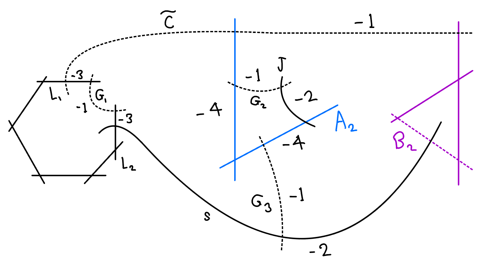
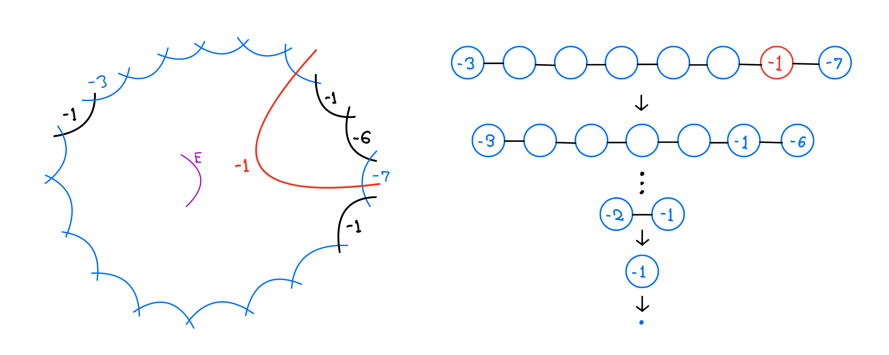

<section id="publications" class="pt-5 pb-5">
  

    <!-- <h2>Publications</h2> -->
    <ol>
      <li>
        A. Khurmi,
        <i>A smoothing of a rational singularity with non finitely-generated canonical ring (Honors Thesis)</i>, 2025.
        <a href="../assets/pdf/thesis.pdf" target="_blank">[PDF]</a>
        

          
Abstract

          

            Let \(X\) be an isolated surface singularity with a one-parameter smoothing \(\mathcal{X}\). 
            If the canonical algebra \(\mathcal{R}\) of \(\mathcal{X}\) is finitely generated (as an \(\mathcal{O}_{\mathcal{X}}\)-algebra), 
            it can be used to define a small modification 
            \(\mathcal{Y} := \text{Proj }\mathcal{R}\) of \(\mathcal{X}\) such that \(K_{\mathcal{Y}}\) is \(\mathbb{Q}\)-Cartier. 
            This is used in the construction of flips in the minimal model program.  
            As discovered by Kollár–Shepherd-Barron in 1988, the finite generation holds when \(X\) is a quotient singularity. 
            The strict transform of \(X\) is a so-called \(P\)-resolution, and all such can be determined combinatorially. 
            They proved that \(\mathbb{Q}\)-Gorenstein deformations of these \(P\)-resolutions describe the components 
            of the versal deformation space of \(X\).  
            János Kollár conjectured that an analogous result holds when \(X\) is a rational singularity. 
            In this paper, I will describe an approach, inspired by a paper of Cutkosky, 
            to disprove the conjecture by constructing a smoothing with non-finitely generated canonical algebra, 
            assuming a hypothesis we expect to be true.
          

          
        

      </li>
      <li>
        A. Khurmi, 
        <i>Toric Elliptic Pairs with Picard Number Three</i>, 2024.
        <a href="https://arxiv.org/abs/2410.15301">[PDF]</a>
        

          
Abstract

            

                An <b>elliptic pair</b> \((X, C)\) is a generalization of a rational elliptic fibration 
                \(X \to \mathbb{P}^1\) with fiber \(C\), <a href="https://bpb-us-e2.wpmucdn.com/websites.umass.edu/dist/7/12783/files/2025/08/nonpoly.pdf">introduced</a> by Castravet-Laface-Tevelev-Ugaglia.
                Here, \(X\) is a projective rational surface with log terminal singularities, 
                and \(C\) is an irreducible curve contained in the smooth locus of \(X\), 
                with \(p_a(C)=1\) and \(C^2=0\). 
                These naturally arise as blowups \(X := \mathrm{Bl}_e(\mathbb{P}_\Delta)\) 
                of projective toric surfaces, whose Newton polygon is <b>elliptic</b>.
                The order of \(\mathcal{O}(C)|_C\) in \(\mathrm{Pic}^0(C)\) 
                gives a quantitative way to check if \(X\) is an elliptic fibration, 
                which is equivalent to finiteness of the order.  
                We call \(\Delta\) a <b>Lang–Trotter polygon</b> when this order is infinite, 
                in which case \(\overline{\text{Eff}(\mathrm{Bl}_e(\mathbb{P}_\Delta))}\) 
                is non-polyhedral.  
                Results of <a href="https://www.sciencedirect.com/science/article/pii/S0022404923000063?via%3Dihub">Pratt</a> shows there are exactly \(3\) elliptic triangles 
                up to \(\mathrm{SL}_2(\mathbb{Z})\), none of which is Lang–Trotter.  
                The same paper by CLTU gives an infinite family of 
                Lang–Trotter pentagons and heptagons, and various examples of other polygons 
                when \(\rho(\mathbb{P}_\Delta) > 2\).  
                Remark 4.7 in the paper asks if any Lang–Trotter quadrilaterals exist, 
                and we answer this in the negative by studying the curves 
                in the Zariski decomposition of \(K_X + C\).
            

             
        

      </li>

    </ol>
  

</section>
